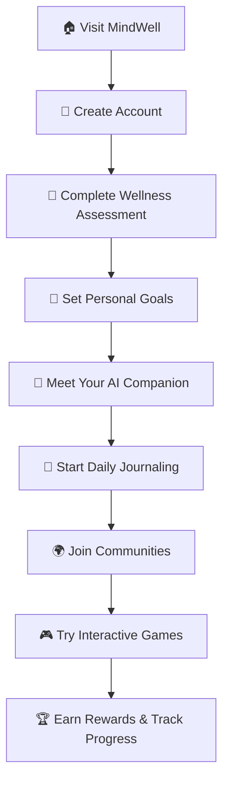

# 🌸 MindWell – A Youth Mental Wellness Platform

<div align="center">


### *An AI-powered platform for young mental wellness combining emotional support, self-reflection, safe communities, and engaging activities.*

[](https://opensource.org/licenses/MIT)
[](https://www.python.org/downloads/)
[](https://flask.palletsprojects.com/)
[](#contributors)

[🚀 Demo](#demo) • [✨ Features](#features) • [🛠️ Installation](#installation) • [📸 Gallery](#gallery) • [👥 Contributors](#contributors)

</div>

---

## 🎯 Table of Contents

- [💡 Introduction](#-introduction)
- [🚩 Problem Statement](#-problem-statement)
- [✨ Features](#-features)
- [📸 Project Gallery](#-project-gallery)
- [🛠️ Tech Stack](#️-tech-stack)
- [🔌 APIs & Models Used](#-apis--models-used)
- [🚀 Installation](#-installation)
- [📊 Usage](#-usage)
- [🎮 Demo](#-demo)
- [🤝 Contributing](#-contributing)
- [👥 Contributors](#-contributors)
- [📄 License](#-license)
- [📞 Support](#-support)

---

## 💡 Introduction

<div align="center">

</div>

Mental health challenges among youth are increasing due to stress, anxiety, and lack of safe outlets. **MindWell** addresses these challenges by creating a comprehensive digital wellness ecosystem that combines cutting-edge AI technology with human-centered design.

### 🎯 Our Mission
- 🤖 Support youth through **AI-driven companions**
- 📝 Encourage **self-reflection** via intelligent diary + emotion detection
- 🌍 Provide **safe anonymous communities** for meaningful discussions
- 🎉 Promote **fun & positivity** through games and motivational content

---

## 🚩 Problem Statement

<div align="center">

| Challenge | Impact | MindWell Solution |
|-----------|--------|------------------|
| 📱 Limited interactive platforms for youth | Low engagement & accessibility | AI-powered personalized interactions |
| 🔒 Lack of anonymous safe spaces | Stigma prevents honest sharing | Anonymous communities with moderation |
| ⬇️ High dropout rates in existing apps | Poor retention & outcomes | Gamification & reward systems |
| 🏥 Insufficient real-time support | Crisis situations unaddressed | 24/7 AI companion + resource finder |

</div>

---

## ✨ Features

<details open>
<summary><h3>🏠 Home Page - Daily Motivation</h3></summary>

- 🌟 **Inspirational Quotes**: Fresh motivational content powered by ZenQuotes API
- 🔄 **Dynamic Content**: New quote on every refresh or click
- 📊 **Wellness Dashboard**: Quick overview of your mental wellness journey
- 🏆 **Achievement Tracker**: Visual progress indicators and milestones

</details>

<details open>
<summary><h3>🤖 AI Emotional Chat Companion</h3></summary>

**Powered by Google Gemini (gemini-2.5-pro)**

| Mode | Description | Features |
|------|-------------|----------|
| 💬 **Text Chat** | Traditional messaging | Smart responses, emotion recognition |
| 🎙️ **Voice-to-Text** | Speak your thoughts | Web Speech API integration |
| 📞 **Call Mode** | Real-time conversation | Speech-to-Speech capability |
| 🧑‍🎤 **3D Avatar Mode** | Immersive experience | Anime model with voice interaction |

**🔍 Real-time Resources**: Automatically fetches helplines and mental health resources via Google Search API

</details>

<details open>
<summary><h3>📖 My Diary - Emotion Intelligence</h3></summary>

- ✍️ **Daily Reflections**: Secure, private journaling experience
- 🧠 **Emotion Detection**: AI-powered mood analysis using Hugging Face models
- 📈 **Mood Visualization**: Beautiful charts showing emotional trends over time
- 🎯 **Personalized Insights**: Data-driven recommendations for wellness
- 💾 **Secure Storage**: All entries encrypted and safely stored

</details>

<details open>
<summary><h3>🌍 Community Feature - Safe Spaces</h3></summary>

- 👥 **Anonymous Communities**: Create or join discussion groups safely
- 🛡️ **Smart Moderation**: Perspective API (Google Jigsaw) prevents abuse
- 🎭 **Auto-generated Usernames**: Protect identity while building connections
- 💰 **Community Creation**: Requires 50 coins to maintain quality spaces
- 🚨 **Crisis Support**: Built-in reporting and support mechanisms

</details>

<details open>
<summary><h3>🎮 Interactive Dance Game</h3></summary>

- 🕺 **Pose Detection**: Advanced Mediapipe technology for accurate movement tracking
- 📺 **Split-Screen View**: Compare your moves with reference videos
- 🏅 **Scoring System**: Real-time feedback and improvement suggestions
- 💪 **Physical Wellness**: Combines mental and physical health benefits
- 🎵 **Music Integration**: Dance to uplifting, therapeutic music

</details>

<details open>
<summary><h3>🪙 Gamification & Rewards</h3></summary>

**Earn coins through positive behaviors:**
- 📅 Daily login streaks
- 📚 Reading motivational quotes  
- 🎯 Platform engagement
- 🏆 Achieving wellness milestones
- 🤝 Community participation

**Spend coins on:**
- 🌍 Creating new communities
- 🎨 Avatar customization
- 🎁 Unlocking premium features

</details>

---

## 📸 Project Gallery

<div align="center">

### 🖼️ **Add Your Screenshots Here**

| Feature | Screenshot |
|---------|------------|
| **🏠 Home Dashboard** |  |
| **🤖 AI Chat Interface** |  |
| **📖 Diary & Analytics** |  |
| **🌍 Community Hub** |  |
| **🎮 Dance Game** |  |

### 📱 **Mobile Responsive Design**
| Mobile View | Tablet View | Desktop View |
|-------------|-------------|--------------|
|  |  |  |

</div>

---

## 🛠️ Tech Stack

<div align="center">

### Frontend


### Backend


### Data & Visualization  


### AI & ML


</div>

---

## 🔌 APIs & Models Used

<div align="center">

| Service | Purpose | Status |
|---------|---------|--------|
| 🌸 **[ZenQuotes API](https://zenquotes.io/)** | Motivational quotes generation | ✅ Active |
| 🤖 **[Google Gemini](https://ai.google/)** | AI chatbot conversations | ✅ Active |
| 🔍 **[Google Search API](https://developers.google.com/custom-search)** | Real-time helpline resources | ✅ Active |
| 🎙️ **[Web Speech API](https://developer.mozilla.org/en-US/docs/Web/API/Web_Speech_API)** | Voice interaction features | ✅ Active |
| 🧠 **[Hugging Face Model](https://huggingface.co/j-hartman/emotional-english-distilroberta-base)** | Emotion detection in diary | ✅ Active |
| 🛡️ **[Perspective API](https://perspectiveapi.com/)** | Community content moderation | ✅ Active |
| 🎮 **[Google Mediapipe](https://developers.google.com/mediapipe)** | Pose detection for dance game | ✅ Active |

</div>

---

## 🚀 Installation

<details>
<summary><h3>📋 Prerequisites</h3></summary>

- Python 3.8 or higher
- Node.js (for development tools)
- Git
- Web browser with microphone/camera support

</details>

<details>
<summary><h3>⚡ Quick Start</h3></summary>

```bash
# Clone the repository
git clone https://github.com/yourusername/mindwell.git
cd mindwell

# Create virtual environment
python -m venv mindwell-env
source mindwell-env/bin/activate  # On Windows: mindwell-env\Scripts\activate

# Install dependencies
pip install -r requirements.txt

# Set up environment variables
cp .env.example .env
# Edit .env with your API keys

# Run the application
python app.py
```

🌐 Open `http://localhost:5000` in your browser

</details>

<details>
<summary><h3>🔑 Environment Setup</h3></summary>

Create a `.env` file with the following variables:

```env
# API Keys
GEMINI_API_KEY=your_gemini_api_key_here
GOOGLE_SEARCH_API_KEY=your_google_search_api_key_here
GOOGLE_SEARCH_ENGINE_ID=your_search_engine_id_here
PERSPECTIVE_API_KEY=your_perspective_api_key_here

# Database Configuration
DATABASE_URL=sqlite:///mindwell.db

# Security
SECRET_KEY=your_secret_key_here
```

</details>

---

## 📊 Usage

<div align="center">

### 🎯 **Getting Started Guide**



</div>

### 💡 **Feature Usage Tips**

- **🤖 AI Chat**: Be open and honest for best emotional support
- **📖 Diary**: Write regularly for accurate mood tracking
- **🌍 Communities**: Follow community guidelines for positive interactions
- **🎮 Games**: Use proper lighting for better pose detection
- **🪙 Rewards**: Check daily for bonus coin opportunities

---

## 🎮 Demo

<div align="center">

### 🌐 **Live Demo**
[](https://your-demo-link.com)

### 🎥 **Video Walkthrough**
[](https://your-video-link.com)

### 📱 **Mobile App**
[](https://your-apk-link.com)

</div>

---

## 🤝 Contributing

<div align="center">

We welcome contributions from developers, designers, mental health professionals, and anyone passionate about youth wellness! 

[](CONTRIBUTING.md)

</div>

### 🛠️ **Ways to Contribute**

- 🐛 **Bug Reports**: Found an issue? Help us fix it!
- ✨ **Feature Requests**: Share ideas for new features
- 💻 **Code Contributions**: Submit pull requests
- 📖 **Documentation**: Improve guides and documentation
- 🎨 **Design**: Enhance UI/UX and accessibility
- 🧠 **Mental Health Expertise**: Provide professional insights

### 📝 **Contribution Guidelines**

1. Fork the repository
2. Create a feature branch (`git checkout -b feature/AmazingFeature`)
3. Commit changes (`git commit -m 'Add AmazingFeature'`)
4. Push to branch (`git push origin feature/AmazingFeature`)
5. Open a Pull Request

---

## 👥 Contributors

<div align="center">

### 🌟 **Meet Our Amazing Team**

<!-- Replace with actual contributor information -->

<table>
  <tr>
    <td align="center">
      <a href="https://github.com/yourusername">
        <br />
        <sub><b>Your Name</b></sub>
      </a><br />
      <sub>🚀 Project Creator</sub><br />
      <sub>💻 Full-Stack Development</sub>
    </td>
    <td align="center">
      <a href="https://github.com/contributor2">
        <br />
        <sub><b>Contributor Name</b></sub>
      </a><br />
      <sub>🤖 AI Integration</sub><br />
      <sub>🧠 Machine Learning</sub>
    </td>
    <td align="center">
      <a href="https://github.com/contributor3">
        <br />
        <sub><b>Designer Name</b></sub>
      </a><br />
      <sub>🎨 UI/UX Design</sub><br />
      <sub>📱 Frontend Development</sub>
    </td>
    <td align="center">
      <a href="https://github.com/contributor4">
        <br />
        <sub><b>Expert Name</b></sub>
      </a><br />
      <sub>🧠 Mental Health Advisor</sub><br />
      <sub>📊 Data Analysis</sub>
    </td>
  </tr>
</table>

### 🏆 **Recognition**

[](https://github.com/yourusername/mindwell/graphs/contributors)

### 📊 **Contribution Stats**


</div>

---

## 🌟 **Special Thanks**

- 🏥 **Mental Health Organizations**: For guidance and resources
- 🎓 **Academic Partners**: For research collaboration  
- 👥 **Beta Testers**: For valuable feedback and testing
- 🌍 **Open Source Community**: For tools and inspiration

---

## 📄 License

<div align="center">

This project is licensed under the MIT License - see the [LICENSE](LICENSE) file for details.

[](LICENSE)

</div>

---

## 📞 Support

<div align="center">

### 🆘 **Need Help?**

| Support Type | Contact Method |
|--------------|----------------|
| 🐛 **Bug Reports** | [GitHub Issues](https://github.com/yourusername/mindwell/issues) |
| 💡 **Feature Requests** | [GitHub Discussions](https://github.com/yourusername/mindwell/discussions) |
| 📧 **Email Support** | mindwell.support@email.com |
| 💬 **Community Chat** | [Discord Server](https://discord.gg/mindwell) |
| 📚 **Documentation** | [Wiki Pages](https://github.com/yourusername/mindwell/wiki) |

### 🚨 **Crisis Support**
If you're experiencing a mental health crisis, please contact:
- 🇺🇸 **National Suicide Prevention Lifeline**: 988
- 🇬🇧 **Samaritans**: 116 123
- 🌍 **International**: [befrienders.org](https://www.befrienders.org/)

</div>

---

<div align="center">

### 💜 **Made with Love for Mental Wellness**


⭐ **Star us on GitHub if MindWell helped you!** ⭐

[](https://github.com/yourusername/mindwell/stargazers)
[](https://github.com/yourusername/mindwell/network/members)
[](https://github.com/yourusername/mindwell/watchers)

---

**MindWell © 2024. Empowering youth mental wellness through technology.**

</div>
